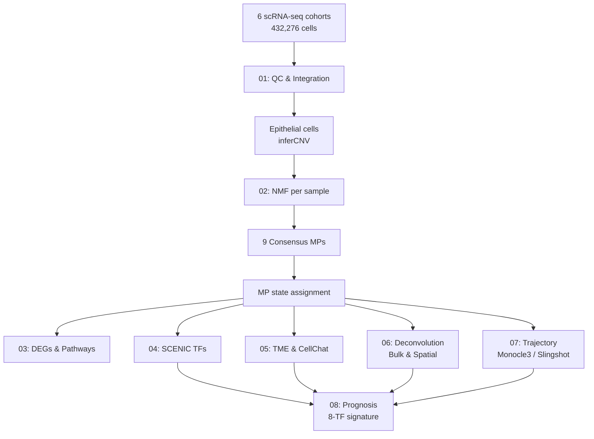

# LUAD Consensus Tumor Cell States

[](https://cran.r-project.org/)
[](https://opensource.org/licenses/MIT)

Code repository for the manuscript:

> **Identifying consensus tumor cell states and characterizing their roles in lung adenocarcinoma progression and clinical outcomes**
>
> Shaobo Kang<sup>1#</sup>, Yijing Zhang<sup>1#</sup>, Renjie Dou<sup>1#</sup>, Yansong Jin<sup>2</sup>, Yanyan Ping<sup>1*</sup>
>
> <sup>1</sup> College of Bioinformatics Science and Technology, Harbin Medical University, Harbin 150081, China  
> <sup>2</sup> College of Computer Science and Technology, Zhejiang University of Technology, Hangzhou 310023, China
>
> <sup>#</sup> These authors contributed equally to this work as first authors.
> <sup>*</sup> Corresponding author: pingyanyan@hrbmu.edu.cn

---

## Abstract

High heterogeneity of malignant cells across lung adenocarcinoma (LUAD) patients highlights the need to define conserved tumor cell states. Here, we identified **nine consensus meta-programs (MPs)** from single-cell transcriptomes of **30,142 malignant cells** across **45 LUAD samples**. Based on dominant MP activities, malignant cells were classified into nine consensus tumor cell states with distinct functional, regulatory, and microenvironmental features. Multi-resolution transcriptomic analyses further revealed progression-associated MP-state dynamics and divergent transcriptional trajectories. Leveraging state-specific transcription factors, we constructed an **eight-TF prognostic signature** that robustly predicted patient survival across multiple independent cohorts.

---

## Repository Structure

```
LUAD-scMetaPrograms/
├── config.R                          # Global path configuration (EDIT THIS FIRST)
├── README.md                         # You are here
├── .gitignore                        # Git ignore rules
├── data/
│   └── README.md                     # Instructions for downloading input datasets
├── results/
│   └── README.md                     # Output directory description
├── manuscript/
│   └── JTM_manuscript.zip            # LaTeX manuscript source files
├── scripts/
│   ├── 01_preprocessing/             # scRNA-seq QC, integration, cell annotation, inferCNV
│   ├── 02_meta_programs/             # NMF-based consensus MP identification
│   ├── 03_state_characterization/    # DEGs, pathway enrichment, MP functional network
│   ├── 04_transcription_factors/     # pySCENIC, VPS72 analysis, TF-target networks
│   ├── 05_tme_communication/         # TME subtyping & CellChat intercellular communication
│   ├── 06_deconvolution/             # Bulk/spatial deconvolution (CIBERSORT, BayesPrism, RCTD)
│   ├── 07_trajectory/                # Pseudotime inference, TF dynamics, gene switching
│   └── 08_clinical/                  # Prognostic model, Scissor, drug sensitivity, ML-based TF selection
└── docs/                             # Supplementary documentation (if any)
```

---

## Workflow Overview



---

## Dependencies

### R (>= 4.2 recommended)

Core packages used across the pipeline:

| Category | Packages |
|----------|----------|
| **Single-cell analysis** | `Seurat` (v5), `harmony`, `SingleCellExperiment` |
| **QC & doublet removal** | `decontX`, `scDblFinder`, `BiocParallel` |
| **CNV inference** | `infercnv` |
| **NMF & MPs** | `NMF`, `scalop` (custom utils included) |
| **Pathway & functional** | `clusterProfiler`, `enrichplot`, `GSVA`, `DOSE` |
| **TF regulons** | `pySCENIC` (Python + R wrapper), `SCopeLoomR` |
| **Cell communication** | `CellChat` |
| **Trajectory** | `monocle3`, `slingshot`, `CytoTRACE`, `GeneSwitches` |
| **Deconvolution** | `IOBR`, `BayesPrism`, `RCTD` |
| **Survival & ML** | `survival`, `survminer`, `glmnet`, `randomForestSRC`, `Mime1` |
| **Visualization** | `ggplot2`, `ComplexHeatmap`, `patchwork`, `ggsci` |
| **Utility** | `tidyverse`, `dplyr`, `reshape2`, `future`, `igraph` |

### Python (>= 3.8)

- `pyscenic` — for gene regulatory network inference
- `loompy` — for loom file manipulation

### Hardware Notes

- **Memory**: Several steps (e.g., NMF on large matrices, pySCENIC, Scissor) require >= 32 GB RAM.
- **CPU**: Parallel processing is used in multiple steps; 8+ cores recommended.

---

## Installation

1. **Clone the repository**

   ```bash
   git clone https://github.com/YOUR_USERNAME/LUAD-scMetaPrograms.git
   cd LUAD-scMetaPrograms
   ```

2. **Install R dependencies**

   We recommend using `renv` or installing packages manually:

   ```r
   install.packages(c("Seurat", "tidyverse", "ggplot2", "survival", "survminer",
                      "glmnet", "future", "patchwork", "reshape2", "ggsci",
                      "ComplexHeatmap", "RColorBrewer", "viridis"))
   
   if (!require("BiocManager", quietly = TRUE))
       install.packages("BiocManager")
   
   BiocManager::install(c("harmony", "decontX", "scDblFinder", "SingleCellExperiment",
                          "infercnv", "clusterProfiler", "enrichplot", "GSVA",
                          "monocle3", "CellChat", "IOBR", "BayesPrism",
                          "Mime1", "SCopeLoomR", "CytoTRACE"))
   ```

3. **Install pySCENIC (Python)**

   ```bash
   pip install pyscenic loompy
   ```

4. **Configure paths**

   Edit [`config.R`](config.R) and set both `BASE_DIR` and `CODE_DIR`:

   ```r
   BASE_DIR <- "~/LUAD_project"        # Directory containing your datasets
   CODE_DIR <- "~/LUAD-scMetaPrograms" # Directory of this repository
   ```

5. **Download input data**

   Follow the instructions in [`data/README.md`](data/README.md) to download all required datasets.

---

## Usage

Scripts are designed to be run sequentially within each module. A typical execution order:

```bash
# Module 1: Preprocessing
Rscript scripts/01_preprocessing/01_merge_and_qc.R
Rscript scripts/01_preprocessing/02_cell_annotation.R
...

# Module 2: Meta-program identification (core)
Rscript scripts/02_meta_programs/01_nmf_input_preparation.R
# Note: 02_nmf_per_sample.R is computationally intensive and should be run on a server.
Rscript scripts/02_meta_programs/03_mp_signature_identification.R
Rscript scripts/02_meta_programs/05_mp_state_assignment.R
...

# Continue through modules 03-08 as needed.
```

> **Important**: All scripts automatically locate `config.R` via a fallback mechanism. If you run scripts from the project root directory (`LUAD-scMetaPrograms/`), they will find `config.R` automatically. Otherwise, ensure `config.R` is reachable or adjust the path at the top of each script.
>
> Before running, edit [`config.R`](config.R) and set `BASE_DIR` and `CODE_DIR` to your local paths.

### Recommended path pattern

```r
# At the top of each script (auto-locates config.R)
source("config.R")

# Then use:
file.path(SC_DATA_DIR, "your_file.rds")
file.path(RESULT_2_DIR, "results_data", "output.rds")
```

---

## Script Index

### 01_preprocessing
| Script | Description |
|--------|-------------|
| `01_merge_and_qc.R` | Merge 6 scRNA-seq cohorts → decontX → scDblFinder → QC filtering |
| `02_cell_annotation.R` | Major cell type annotation (epithelial, immune, stromal) |
| `03_cell_proportions.R` | Cell proportion analysis across samples |
| `04_epithelial_subtyping.R` | Epithelial cell subtyping (normal vs tumor) |
| `05_infercnv.R` | CNV-based discrimination of malignant vs normal epithelial cells |

### 02_meta_programs
| Script | Description |
|--------|-------------|
| `01_nmf_input_preparation.R` | Extract tumor epithelial cells & prepare NMF input |
| `02_nmf_per_sample.R` | Server-side per-sample NMF (rank 4-9, nrun 10) |
| `03_mp_signature_identification.R` | Robust NMF program clustering → 9 consensus MPs |
| `04_mp_functional_annotation.R` | GO / Hallmark functional annotation of MPs |
| `05_mp_state_assignment.R` | Assign dominant MP to each malignant cell (sigScores) |
| `06_mp_stage_association.R` | MP proportions across early vs advanced LUAD |
| `07_mp_prognosis_bulk.R` | MP signature scores in bulk data (ssGSEA) |
| `08_mp9_emt_stemness_correlation.R` | Correlation of MP9 with EMT/stemness programs |
| `09_mp_ratio_analysis.R` | MP ratio calculations and visualizations |

### 03_state_characterization
| Script | Description |
|--------|-------------|
| `01_degs_and_pathways.R` | State-specific DEGs and GSVA pathway scoring |
| `02_state_signature_validation.R` | Validation of tumor state signatures |
| `03_mp_functional_network.R` | MP functional enrichment network (GO-BP, emapplot) |

### 04_transcription_factors
| Script | Description |
|--------|-------------|
| `01_pyscenic_pipeline.R` | GRN inference → cisTarget → AUCell (pySCENIC) |
| `02_vps72_characterization.R` | Focused analysis on VPS72 regulon |
| `03_vps72_spatial.R` | VPS72 expression in spatial transcriptomics |
| `04_tf_target_network.R` | TF-target network construction (Cytoscape-ready) |

### 05_tme_communication
| Script | Description |
|--------|-------------|
| `01_t_nk_subtyping.R` | T/NK cell subtyping |
| `02_b_subtyping.R` | B cell subtyping |
| `03_myeloid_subtyping.R` | Myeloid cell subtyping |
| `04_endothelial_subtyping.R` | Endothelial cell subtyping |
| `05_fibroblast_subtyping.R` | Fibroblast subtyping |
| `06_cellchat_analysis.R` | CellChat intercellular communication analysis |
| `07_lr_pair_visualization.R` | Ligand-receptor pair visualization (main figures) |
| `08_lr_spatial_expression.R` | Differential L-R expression in spatial data |
| `09_lr_cancer_region.R` | L-R expression in cancer regions (ST) |
| `10_lr_prognosis.R` | Prognostic value of L-R pairs |

### 06_deconvolution
| Script | Description |
|--------|-------------|
| `01_iobr_cibersort.R` | CIBERSORT deconvolution of MP proportions |
| `02_bayesprism.R` | BayesPrism deconvolution (bulk) |
| `03_tumor_ratio_clustering.R` | Tumor MP score clustering |
| `04_rctd.R` | RCTD spatial deconvolution (Visium) |
| `05_rctd_visualization.R` | RCTD spatial visualization |


### 07_trajectory
| Script | Description |
|--------|-------------|
| `01_slingshot.R` | Slingshot trajectory inference |
| `02_monocle3.R` | Monocle3 trajectory analysis |
| `03_cnv_stemness_scores.R` | CNV score + stemness score along pseudotime |
| `04_tf_pseudotime_heatmap.R` | ClusterGVis: TF activity heatmap along pseudotime |
| `05_clustergvis_all_mp_cells.R` | ClusterGVis: all MP cells trajectory visualization |
| `06_gene_switch_analysis.R` | GeneSwitch: gene switching along pseudotime |

### 08_clinical
| Script | Description |
|--------|-------------|
| `01_univariate_survival.R` | Univariate Cox + Lasso for TF signature |
| `02_scissor_analysis.R` | Scissor: link bulk survival to scRNA-seq cells |
| `03_multivariate_cox.R` | Multivariate Cox regression |
| `04_immune_infiltration.R` | ESTIMATE immune infiltration |
| `05_immune_celltype_infiltration.R` | Cell-type-specific immune infiltration |
| `06_drug_sensitivity.R` | Drug sensitivity prediction (oncoPredict) |
| `07_stage_stratified_survival.R` | Stage-stratified survival analysis |
| `08_ml_tf_selection.R` | Mime1 ML framework for optimal TF selection |
| `09_riskscore_drug_correlation.R` | Risk score vs predicted drug sensitivity |
| `10_stage_riskgroup_distribution.R` | Stage distribution across risk groups |
| `11_riskgroup_drug_sensitivity.R` | Drug sensitivity by risk group |

---

## Key Results

| Result | File / Location |
|--------|-----------------|
| **9 Consensus MPs** | `Result_2/results_data/02_Malig_final_MP_top50.RData` |
| **MP state assignments** | `Result_2/results_data/04_LUAD_Epi_assigned_MP_final.rds` |
| **State-specific TFs** | `Result_4/results_data/01_top5_TF.rds` |
| **CellChat object** | `Result_5/results_data/cellchat.rds` |
| **Monocle3 CDS** | `Result_7/results_data/03_cds_monocle3.rds` |
| **8-TF prognostic model** | `Result_8/results_data/01_lasso.rds` |
| **Scissor annotations** | `Result_8/results_data/02_LUAD_Epi_assigned_MP_Scissor.rds` |
| **ML model (Mime1)** | `Mime_res_batch_corrected.rds` (generated by script 08) |

---

## Citation

If you use this code or the MP-state framework in your research, please cite:

```
Kang S, Zhang Y, Dou R, Ping Y. Identifying consensus tumor cell states and characterizing 
their roles in lung adenocarcinoma progression and clinical outcomes. [Journal]. Year.
```

*(Details will be updated upon formal publication.)*

---

## License

This project is licensed under the MIT License — see the repository for details.

---

## Contact

For questions about the code, please open an issue on GitHub or contact:

- **Yanyan Ping** (Corresponding author): pingyanyan@hrbmu.edu.cn
- **Shaobo Kang / Yijing Zhang / Renjie Dou** (First authors)

College of Bioinformatics Science and Technology  
Harbin Medical University, Harbin 150081, China
